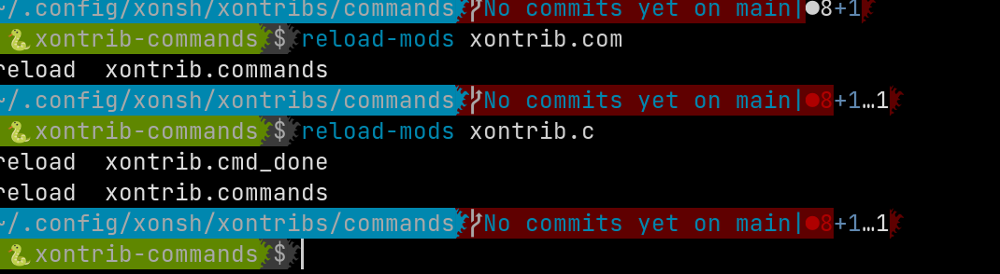
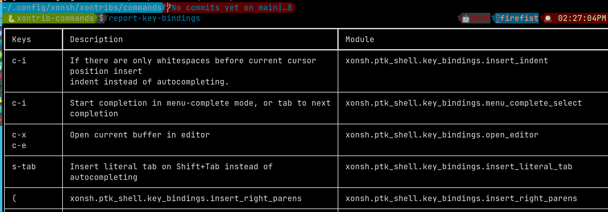

<p align="center">
Useful xonsh-shell commands/alias/completer functions
</p>

## Installation

To install use pip:

``` bash
xpip install xontrib-commands
# or: xpip install -U git+https://github.com/jnoortheen/xontrib-commands
```

## Usage

``` bash
xontrib load commands
```

## building alias

Use [`xontrib.commands.Command`](https://github.com/jnoortheen/xontrib-commands/blob/main/xontrib/commands.py#L9) 
to build [arger](https://github.com/jnoortheen/arger) dispatcher
for your functions.

```py
from xontrib.commands import Command
@Command.reg
def record_stats(pkg_name=".", path=".local/stats.txt"):
    stat = $(scc @(pkg_name))
    echo @($(date) + stat) | tee -a @(path)
```

Now a full CLI is ready
```sh
$ record-stats --help                                                                        
usage: xonsh [-h] [-p PKG_NAME] [-a PATH]

optional arguments:
  -h, --help            show this help message and exit
  -p PKG_NAME, --pkg-name PKG_NAME
  -a PATH, --path PATH
```

## Commands

- each of the commands use argparser. Please use `cmd --help` to get more info and usage examples.

### 1. reload-mods


### 2. report-key-bindggs


### 3. dev
- command to cd around fast. 
- much like https://github.com/ohmyzsh/ohmyzsh/tree/master/plugins/pj

## Credits

This package was created with [xontrib cookiecutter template](https://github.com/jnoortheen/xontrib-cookiecutter).
